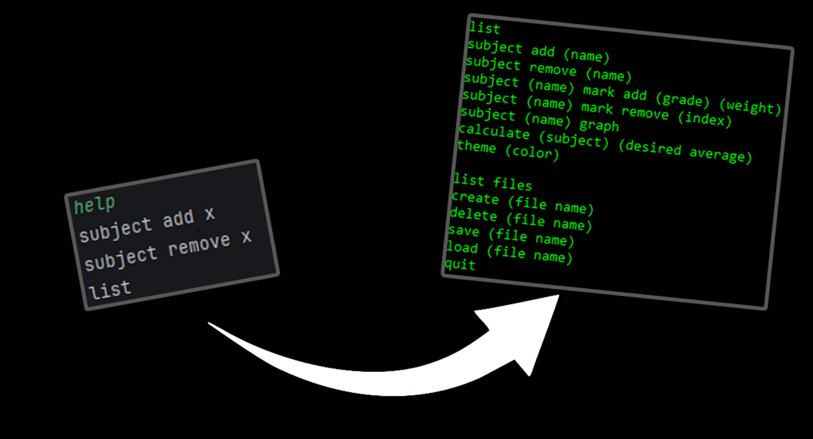

# Student Grade Tracker

A customizable Java console application to track student grades, with features to input grades, calculate averages, and visualize performance through graphs.

---

## ✨ Features

- 📊 **Grade Tracking**: Add and edit your own grades.
- 📈 **Graphing**: Visualize performance with graphs showing trends.
- ⚙️ **Customizable**: Easily configurable for different UI experience.

---

## 🛠️ Tech Stack

- **Language:** Java
- **Libraries:** JFreeChart (for graphing)
- **Tools:** IntelliJ IDEA

---

## 📄 Documentation

For detailed documentation, please refer to the [**DOKUMENTACE.pdf**](https://github.com/FunnyMartin/student-grade-tracker/blob/master/DOKUMENTACE.pdf).

---

## 📸 Preview

> 

---

## 🚀 Getting Started

1. Clone the repo:
   ```bash
   git clone https://github.com/FunnyMartin/student-grade-tracker.git
2. Open the compiled jar file

---

## 📄 License
This project is licensed under the MIT License.

---

## 🙌 Credits
Graphing Library: JFreeChart (https://www.jfree.org/jfreechart/)

Project Idea: Inspired by general grade tracking systems.
